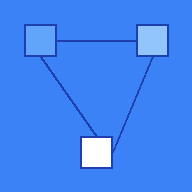

# 🧠 Microservices Mastery

A Progressive Web App (PWA) for learning microservices architecture using Reinforcement Learning-inspired techniques.

## 🚀 Live Demo

**[Open the App](https://YOUR_USERNAME.github.io/microservices-rl-pwa)**

*(Replace YOUR_USERNAME with your GitHub username after deployment)*

## 📱 Install on Your Phone

1. Open the app link in your mobile browser (Chrome/Safari)
2. Tap **"Add to Home Screen"** when prompted
3. Use it **offline** — all data stays on your device!

## 🎯 What is This?

This PWA gamifies your microservices learning journey using RL concepts:

- **Episodes** = Training steps (20 structured learning episodes)
- **Rewards** = Points for good patterns, penalties for anti-patterns
- **Reflections** = Experience Replay — revisit and reinforce learning
- **Progress Tracking** = Visual dashboard showing your journey

## 🗂️ Structure

- **Phase 1:** Foundations (Episodes 1-3)
- **Phase 2:** Core Patterns (Episodes 4-8)
- **Phase 3:** Orchestration (Episodes 9-15)
- **Phase 4:** Meta-Learning (Episodes 16-20)

## 📊 Features

- ✅ Offline-first PWA with Service Worker
- ✅ Episode tracking with automatic reward calculation
- ✅ Reflection journal with mood tracking
- ✅ Progress dashboard with stats
- ✅ Data export for backup
- ✅ Mobile-optimized dark theme

## 🛠️ Tech Stack

- HTML5 / CSS3 / Vanilla JavaScript
- LocalStorage for offline data persistence
- Service Worker for offline caching
- Web App Manifest for installability

## 📦 Deploy to GitHub Pages

1. Fork or push this repo to GitHub
2. Go to **Settings → Pages**
3. Select **Deploy from a branch** → Choose `main` branch
4. Your app will be live at `https://YOUR_USERNAME.github.io/microservices-rl-pwa`

## 💾 Data Privacy

All your learning data is stored **locally in your browser**. No server, no tracking, no data collection. You own your progress.

## 📝 License

MIT — Free to use and modify for your learning journey.
